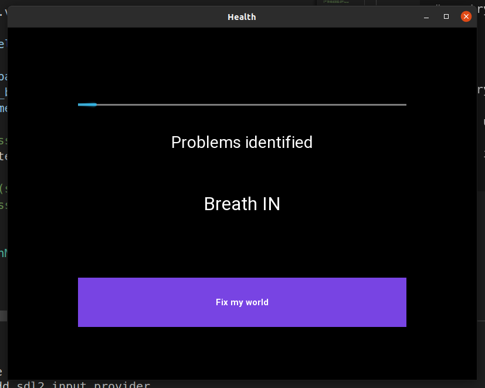
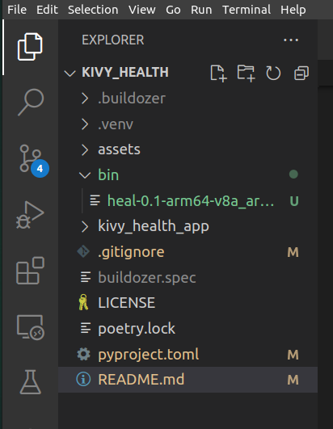

# kivy_health

This is a simple kivy app.


The purpose of this app is to give the user a 10 sek break.


# Install

The Repo is created with poetry.

```dash

# create virtual environment
python -m venv .venv

# poetry
python -m pip install --upgrade pip

python -m pip install poetry

# poetry update and install of packages

poetry update --lock -vvv

poetry install

```

## Screens

The App contains about 2 Screen. 

A start screen that will lead after a few seconds to the second screen, that will do the magic.




If you push the button, it will take your problems for 10 seconds away, while you are breathing.


# To make an android app

Install `javac` see [here](https://stackoverflow.com/questions/66853462/how-to-install-javac-on-linux-mint).

```dash

# for Ubuntu
sudo apt-get install openjdk-8-jdk

# check version
javac -version   
# javac 1.8.0_352

```

Install buildozer in the virtual environment with poetry

```dash

poetry add buildozer

poetry add cython

# do not miss to add `.buildozer` to  .gitignore  file

```

Install [sdkmanager](https://developer.android.com/studio/command-line/sdkmanager)


Download the latest "command line tools only" package from the Android Studio downloads page and unzip the package.
Move the unzipped cmdline-tools directory into a new directory of your choice, such as android_sdk. This new directory is your Android SDK directory.

Add the unzipped files to your .venv or .buildozer/android/app/plattform/android-sdk/tools/....


## Config buildozer

Be sure libssl-dev and java is up-to-date on your machine. it cause strange errors like not installing sdk-tools on the machine or not establishing ssl download conections.

```dash

sudo apt-get update

sudo apt-get install libssl-dev

java -version #1.8

sudo apt install default-jre

java -verion #11.8

```

In case sdk-tools get not installed, do it manually, but there is a deeper problem.

https://stackoverflow.com/questions/59330223/sdkmanager-not-installed

Download the SDK manager here: wget https://dl.google.com/android/repository/sdk-tools-linux-3859397.zip (run this on your command line in your buildozer directory)

Then you unzip it with the command: $ unzip sdk-tools-linux-3859397.zip

when you see a tools directory you have successfully installed sdkmanager

Then edith your .spec file(in your kivy app folder) line 112 with the path where you unzipped your SDK file

andriod.sdk_path = (Your file path) eg /home/freezy/buildozer/


´´´dash
# buildozer.spec  file: 
# line 127
# (str) Android SDK directory (if empty, it will be automatically downloaded.)
#android.sdk_path =
android.sdk_path = /home/heiko/Repos/kivy/kivy_health_repo/kivy_health/.buildozer/android/platform/android-sdk/tools/bin/sdkmanager.sh

# copy unzipped downloaded sdkmanager into the folder android-sdk/tools/bin/...
# problem solved with update libssl-dev

```

Following the description [here](https://realpython.com/mobile-app-kivy-python/)

´´´dash

# to make it testable

buildozer init

buildozer -v android debug

```

When running buildozer to create the android related files they will show up in the new created `bin` folder.





